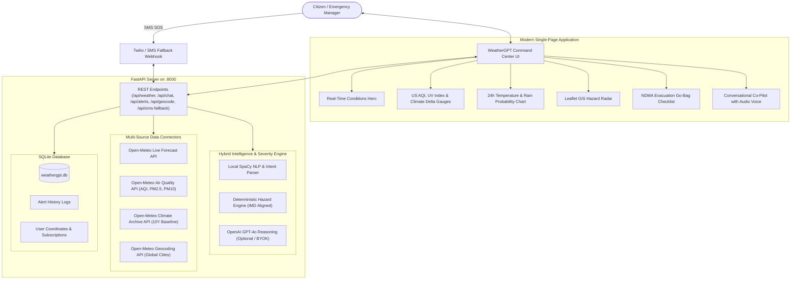

# WeatherGPT: AI Weather & Disaster Intelligence Command Center
**Smart India Hackathon 2026** — Problem Statement ID: **SIH26068**  
**Theme:** Disaster Management | **Category:** Software | **Team:** Cryptic (Team ID: 102)

---

## 🌟 Executive Summary
**WeatherGPT** is a next-generation conversational weather forecasting, proactive alert, climate intelligence, and disaster management command platform. Unlike generic text-based chatbots (such as standard ChatGPT or Gemini clones) that passively wait for questions and lack deterministic hazard grounding, WeatherGPT is purpose-built as an **authoritative disaster intelligence console**:

1. **Deterministic Hazard Severity Engine**: Evaluates live meteorological conditions against **IMD (India Meteorological Department)** alert color codes (`GREEN`, `YELLOW`, `ORANGE`, `RED`), guaranteeing zero hallucination during life-safety crises.
2. **Proactive Alert Broadcast**: Automatically broadcasts hazard warnings (flash floods, cyclones, severe heatwaves, toxic AQI smog, cloudbursts) before the user even enters a prompt.
3. **10-Year Climate Anomaly Tracking**: Queries high-resolution atmospheric reanalysis archive (Open-Meteo Archive) to compute long-term temperature anomalies and micro-climate shifts compared to 10 years ago today.
4. **Hybrid AI & Local NLP**: Functions 100% locally out-of-the-box using SpaCy (`en_core_web_sm`) and meteorological expert heuristics with zero API costs, and seamlessly upgrades to OpenAI GPT-4o with tool-calling whenever an API key is supplied.
5. **Emergency Low-Bandwidth SMS Fallback**: A Twilio-compatible webhook and simulated feature-phone console that condenses critical forecast and evacuation advice into 160 characters for citizens caught in data network blackouts.
6. **Voice & Multimodal Briefing**: Supports Web Speech API for voice queries and audio speech synthesis for auditory hazard alerts.

---

## 🏗️ Architecture & Technology Stack



---

## 🚀 Quick Start Guide

### Prerequisites
- Python 3.10+ installed

### 1. Launch with One Click
Run either:
- On Windows Command Prompt:
  ```cmd
  start.bat
  ```
- On PowerShell:
  ```powershell
  .\start.ps1
  ```
- Or directly via Python:
  ```bash
  python -m pip install -r requirements.txt
  python -m uvicorn weathergpt_backend:app --host 0.0.0.0 --port 8000 --reload
  ```

### 2. Access the Command Center
Open your browser and navigate to:
```
http://localhost:8000
```
- Interactive Command Dashboard: `http://localhost:8000/`
- Interactive API Documentation (Swagger): `http://localhost:8000/docs`

---

## 🧪 Testing Scenarios & Evaluator Walkthrough

### Scenario 1: Natural Language Weather & Lifestyle Inquiries
Try asking WeatherGPT in the conversational side-panel:
- *"Will I need an umbrella in Mumbai today?"*
- *"Is it safe to go for a run outside right now?"*
- *"What should I wear for this weather?"*
- *"What is the air quality and should I wear a mask?"*

### Scenario 2: 10-Year Climate Change Tracking
- Click the **`🌍 10-Yr Climate`** prompt chip or ask:
  *"How does today's weather compare to 10 years ago?"*
- Notice the **10-Year Climate Delta** telemetry gauge dynamically comparing today's live temperature against the historical reanalysis archive from exactly a decade ago.

### Scenario 3: Proactive Disaster Drills & IMD Color Coding
- Click the **`🔥 Disaster Drill`** button in the header navigation.
- Watch the platform transition into emergency drill mode (e.g. `Flash Flood (RED Alert)` or `Severe Heatwave (ORANGE Alert)`).
- The pulsing IMD badge changes color, the interactive GIS map highlights the hazard perimeter, the proactive alert banner sounds, and the evacuation go-bag checklist renders specific life-saving instructions.

### Scenario 4: Low-Bandwidth SMS Fallback Simulator
- Click the **`💬 SMS Fallback`** button in the header.
- Type `WEATHER SHIMLA` or `SOS MUMBAI` and click **Transmit**.
- See the exact 160-character disaster response formatted for cellular SMS broadcasts when internet connectivity collapses.

---

## 🛡️ Aligned Authorities & Standards
- **IMD (India Meteorological Department)**: Weather codes and color-coded alert matrix (Green, Yellow, Orange, Red).
- **NDMA (National Disaster Management Authority)** & **SACHET Portal**: Immediate disaster survival protocols and evacuation kits for Floods, Cyclones, Heatwaves, Thunderstorms, and Smog.
- **WMO (World Meteorological Organization)**: Standard 40-class weather codes and air quality thresholds.
